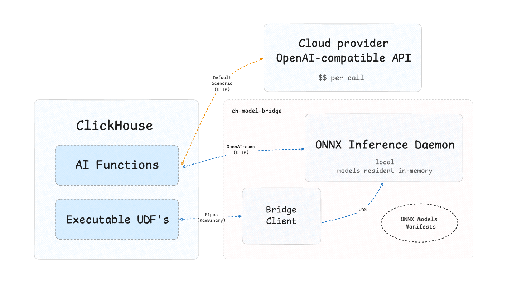

[](LICENSE)

## TL;DR

Run ML models inside ClickHouse locally. A small daemon keeps ONNX models on the database host and ClickHouse calls them through its stock extension points. No data leaving the machine, no per-token bill

## Why

ClickHouse ships AI functions, but they are HTTP clients for cloud providers. That works for a few ad-hoc rows and breaks on real database
workloads:

- **Cost.** Providers bill per token on every run
- **Volume.** ClickHouse processes data in blocks of ~65k rows, but every AI function is a remote API call and must slice each block into tiny requests at most 100 rows per call for embeddings, roughly one call per row for the chat-based functions — each paying network latency. The bridge speaks the database's own unit of work: whole blocks over a local unix socket
- **Privacy.** With a provider, every row leaves the machine. Here it never does

## How it works



The bottom path from the picture is the main one:

`localEmbed`, `localRerank` and `modelEvaluate` are executable UDFs: ClickHouse streams whole ~65k row batches into a pool of thin `bridge-client` processes, which forward them over a socket to the daemon

Every model is defined by a manifest: the SHA-256 of each file the runtime
loads, plus a pinned revision. Where the files came from is irrelevant — the
manifest is the identity. The daemon verifies it before serving and refuses
to start on any mismatch, so a given revision always produces the same
vectors

The daemon keeps each model in memory once per host. Requests from all
clients merge into shared batches and inference runs off the network path on
a blocking pool

The top path exists for compatibility. ClickHouse's stock AI functions are
OpenAI-protocol HTTP clients, and the daemon speaks that protocol, so
existing `aiEmbed` SQL works against local models unchanged

## Quick start

You need stable Rust (1.88+) and a `clickhouse` binary

`cargo build` produces the three binaries this page use:

- `bridged` is the daemon, it loads the models and answers ClickHouse
- `model-bridge` is the admin tool: it registers models and generates ClickHouse configs
- `bridge-client` is a small adapter that ClickHouse spawns by itself, you never run it by hand

Take a model you do not have yet — say, embedding weights published on Hugging Face — and walk it to a first query in four steps.

**1. Register a model.** The daemon serves models from local disk: a model is a directory with the weights plus a manifest recording their checksums. The `--name` you pick is the name SQL will use:

```bash
mkdir -p models/e5

curl -L -o models/e5/model.onnx \
    https://huggingface.co/Xenova/multilingual-e5-small/resolve/main/onnx/model_quantized.onnx

curl -L -o models/e5/tokenizer.json \
    https://huggingface.co/Xenova/multilingual-e5-small/resolve/main/tokenizer.json

model-bridge passport models/e5 --name e5 --kind embedding
```

**2. Start the daemon.** On start `bridged` reads the manifests from `models.d/`, re-verifies every file against its SHA-256, loads the models into memory, and only then opens its two entrances: unix socket at the path you pass, and HTTP on `127.0.0.1:9017`. Leave it running and remember the socket path - ClickHouse will connect to exactly this file:

```bash
bridged --socket /tmp/bridge.sock
```

**3. Generate the ClickHouse configs.** This command is the moment the XML gets generated:

```bash
model-bridge gen-configs --client "$(which bridge-client)" --socket /tmp/bridge.sock
```

It writes a `bridge-configs/` directory with two things. `model_bridge_functions.xml` declares the three functions and bakes the socket path from step 2 into each one's command line, that is how the adapter will find the daemon. And `bridge-client` is copied into `bridge-configs/scripts/`, because ClickHouse only spawns commands that live inside its own `user_scripts_path`

Nobody hands these files to ClickHouse automatically — you do it once. The command prints two config lines with real absolute paths; put them into the ClickHouse server config and reload:

```xml
<user_defined_executable_functions_config>/abs/path/bridge-configs/model_bridge_functions.xml</user_defined_executable_functions_config>
<user_scripts_path>/abs/path/bridge-configs/scripts</user_scripts_path>
```

From that reload ClickHouse knows the functions. When a query calls one, ClickHouse itself spawns `bridge-client` from the scripts directory, and the adapter connects to the daemon's socket — the circle closes

**4. Verify.**

```sql
SELECT length(localEmbed('e5', 'hello world')) -- 384 a real embedding, computed on your machine
```

**Optional — redirect an existing `aiEmbed`.** Already calling `aiEmbed` with a cloud provider? The daemon speaks the same protocol, so one named collection retargets it; queries and dashboards stay as they are:

```xml
<named_collections>
    <local_emb>
        <provider>openai</provider>
        <endpoint>http://127.0.0.1:9017/v1/embeddings</endpoint>
    </local_emb>
</named_collections>
```

```sql
SET allow_experimental_ai_functions = 1,
    ai_function_embedding_default_credentials = 'local_emb';
```
